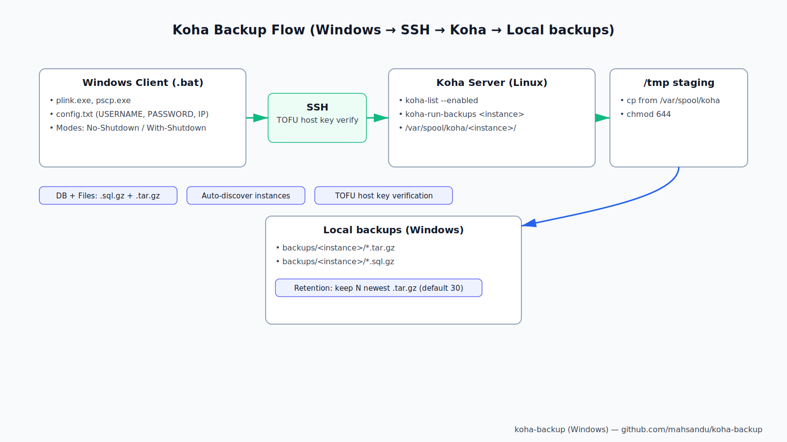

# Koha Backup System - Complete User Guide

## 🗺️ Illustrated Overview



### At-a-glance: what you do
- Create a restricted “backup” user on the Koha server (one-time)
- Put 3 values in config.txt (USERNAME, PASSWORD, IP)
- Run one of the launchers: backup-no-shutdown.bat or backup-with-shutdown.bat

### How it flows

```
Your Windows PC                           Koha Server (Linux)
------------------                        -------------------
backup-*.bat                              koha-list --enabled
plink.exe / pscp.exe   === SSH ===>       koha-run-backups <instance>
HOSTKEY verified        (PuTTY)           cp /var/spool/koha/... -> /tmp
                                           chmod 644 /tmp/*
     ^                                         |
     |                 <== pscp download ======|
     |                                         v
backups\<instance>\*.tar.gz / *.sql.gz    Files staged in /tmp
backup_log.txt (all actions)              (cleaned by system later)
Retention: keep N newest .tar.gz
Optional: send shutdown after backups
```

### Which script do I run?
- Daily/normal use (server must stay online): run `backup-no-shutdown.bat`
- Maintenance window (ok to power off server): run `backup-with-shutdown.bat`

### Where things live
```
koha-backup-shutdown\
├─ config.txt                  # Your settings (3 required values)
├─ backup-no-shutdown.bat      # Launcher: backup only
├─ backup-with-shutdown.bat    # Launcher: backup + shutdown
├─ tools\                      # Auto-downloaded plink.exe / pscp.exe
└─ backups\                    # Results
   ├─ backup_log.txt
   └─ <instance>\*.tar.gz / *.sql.gz
```

### One-minute quick start
1) Create backup user (Windows, guided):
```powershell
cd setup
.\setup-backup-user.bat
```
2) Configure 3 values in `config.txt` (USERNAME, PASSWORD, IP)

3) Run a backup (no shutdown):
```powershell
.\backup-no-shutdown.bat
```

You’ll see downloads per instance and a summary. Check `backups\backup_log.txt` if anything fails.

## Quick Answers to Common Questions

### 📝 How it creates backup user?

**Two ways to create the backup user:**

#### Option 1: Automated from Windows (Easiest)
```powershell
cd setup
.\setup-backup-user.bat
```
- Interactive prompts guide you through the process
- You need: Server IP, root username/password
- The script automatically:
  - Uploads `backup-user.sh` to the server
  - Runs it as root to create a restricted user
  - Sets up minimal sudo permissions (only for backup commands)
  - Returns the backup username/password to use in `config.txt`

**User Interaction:** 5-6 prompts (server IP, root credentials, backup username/password, shutdown permission)

#### Option 2: Manual on Linux Server
```bash
sudo bash backup-user.sh --user backup --password 'YourPassword123'
```
- Run directly on the Koha server as root
- Creates a user with restricted sudo rights:
  - ✅ Can run `koha-run-backups`
  - ✅ Can copy files from `/var/spool/koha` to `/tmp`
  - ✅ Can change file permissions (chmod 644)
  - ✅ Optionally can shutdown server
  - ❌ Cannot do anything else

### 🔧 Where to configure SSH settings?

**Single configuration file: `config.txt` (at repository root)**

```plaintext
# Remote server credentials
USERNAME=root
PASSWORD=test@123
IP=10.10.10.105

# SSH host key fingerprint (auto-discovered on first run if blank)
HOST_FINGERPRINT=SHA256:zkRgpJmh+WcUyVvUonvhXTDZJVL5iIHlxDrfcY2RbQk

# Number of backup files to keep (older files are deleted)
RETENTION_FILES=30
```

**That's it!** Only 3 required settings:
1. `USERNAME` - SSH username
2. `PASSWORD` - SSH password  
3. `IP` - Server IP address

Optional settings auto-configure themselves.

### 📥 Where backups are downloaded?

**Local folder structure:**
```
koha-backup-shutdown/
├── backups/
│   ├── library/
│   │   ├── library-2025-11-01.tar.gz
│   │   └── library-2025-11-01.sql.gz
│   ├── catalog/
│   │   ├── catalog-2025-11-01.tar.gz
│   │   └── catalog-2025-11-01.sql.gz
│   └── backup_log.txt
```

- Each Koha instance gets its own subfolder
- Both `.tar.gz` (files) and `.sql.gz` (database) are downloaded
- Logs are saved to `backups/backup_log.txt`
- Old backups are automatically deleted (keeps last 30 by default)

### 👤 How many times user has to interact?

**One-time setup (5-10 minutes):**
1. ✅ Create backup user on server (1-2 minutes) - 5-6 prompts
2. ✅ Edit `config.txt` with credentials (1 minute) - 3 values
3. ✅ Test first backup (2-3 minutes) - no interaction, just wait

**Daily usage: ZERO interaction!**
- Just run: `.\backup-no-shutdown.bat`
- Or schedule with Windows Task Scheduler (runs automatically)
- Script handles everything: auto-discovery, download, cleanup, logging

**Total setup questions:** ~8 prompts during initial setup
**Daily questions:** 0 (fully automated)

### 👥 Is it easy for non-technical users?

**YES!** Designed specifically for non-technical users:

✅ **Simple Configuration:**
- Copy `config.txt.example` to `config.txt`
- Fill in 3 values (username, password, IP)
- Done!

✅ **Auto-discovery:**
- Finds all Koha instances automatically
- No need to know instance names
- No need to configure paths

✅ **Self-contained:**
- Downloads required tools automatically (plink.exe, pscp.exe)
- No manual installation needed
- Works on any Windows 10/11 computer

✅ **Clear feedback:**
- Shows progress for each instance
- "Downloaded: filename.tar.gz" messages
- All actions logged to `backup_log.txt`

✅ **Safe operation:**
- Cannot damage server (restricted user permissions)
- Cannot delete important files
- Backups go to isolated folder

❌ **Minimal technical knowledge needed:**
- Know how to copy/paste text
- Know how to run a .bat file (double-click)
- That's all!

### 🗄️ What type of Koha installation it supports?

**Supports ALL standard Koha installations:**

✅ **Package Installation (Debian/Ubuntu):**
- Installed via `apt-get install koha-common`
- Uses `/var/spool/koha/<instance>` for backups
- **This is the most common installation type**
- ✅ Fully supported

✅ **Multi-tenant Installations:**
- Multiple Koha instances on same server
- Auto-discovers all enabled instances
- Downloads backups for each instance separately

✅ **Single-instance Installations:**
- Works perfectly with just one Koha instance
- Auto-discovers that single instance

✅ **Standard backup locations:**
- `/var/spool/koha/<instance>/` (default)
- Script looks for `.tar.gz` and `.sql.gz` files

❌ **NOT supported (rare installations):**
- Manual "git" installations with custom backup paths
- Non-standard backup locations (without `/var/spool/koha/`)
- Installations without `koha-run-backups` command
- Docker containers (different approach needed)

**95% of Koha installations use package installation = ✅ Fully supported**

### 🐧 Is there any Linux expert needed to run this script?

**NO Linux expertise required for daily use!**

**Setup phase (one-time, 5-10 minutes):**
- ⚠️ Need basic Linux access to create backup user
- Options:
  1. **Easiest:** Use `setup-backup-user.bat` from Windows (automated)
  2. **Manual:** Copy/paste one command as root on Linux server
- No need to understand Linux commands
- No need to edit Linux configuration files
- No need to troubleshoot Linux issues

**Daily backup operations:**
- 🎉 **ZERO Linux knowledge needed**
- Run `.bat` file on Windows
- Everything happens automatically
- No SSH terminal needed
- No Linux commands to type

**Who can use this:**
- ✅ Windows users with no Linux experience
- ✅ Library staff with basic computer skills
- ✅ System administrators (Windows-focused)
- ✅ Anyone who can double-click a file

**Who needs Linux expertise:**
- ❌ Nobody for daily use!
- ⚠️ Only IT person during initial setup (5 minutes)

### 🔒 Is code protected from modifying?

**Current state: Partially protected**

**Source Code Protection:**
- ✅ Scripts are open source (.bat files)
- ❌ Anyone can read and edit .bat files
- ❌ Passwords visible if hardcoded in scripts

**Configuration Protection:**
- ✅ Credentials in separate `config.txt` file
- ⚠️ Config file is plain text (readable)
- ✅ Config file can be secured with Windows file permissions

**Available Protection Methods:**

#### Level 1: Basic Protection (Current)
```
✅ config.txt in .gitignore (not committed to GitHub)
✅ Passwords in config file, not in scripts
⚠️ Anyone with file access can read config.txt
```

#### Level 2: Compiled EXE (Available)
```
✅ Convert .bat to .exe using IExpress or Bat2Exe
✅ Users cannot easily edit the script logic
✅ Basic obfuscation of workflow
⚠️ Still uses config.txt for credentials
⚠️ Can be decompiled with effort
```
See: `build/build-exe.md` for instructions

#### Level 3: Maximum Security (Recommended for sensitive environments)
```
✅ Compiled EXE from PowerShell (PS2EXE)
✅ Windows Credential Manager for passwords
✅ SSH key authentication (no password in files)
✅ Code signing certificate (prevents tampering)
✅ File permissions restrict config.txt access
```

**Recommended Security Setup:**

1. **For home/small library:**
   - Use .bat files as-is
   - Set Windows file permissions on `config.txt` (right-click → Properties → Security)
   - Only allow specific users to read the file

2. **For professional/enterprise:**
   - Compile to .exe using `build-exe.ps1`
   - Use SSH key authentication (remove password from config)
   - Store in restricted folder (C:\ProgramData\KohaBackup\)
   - Grant access only to backup admin account

3. **For maximum security:**
   - Remove passwords entirely
   - Use Windows Credential Manager
   - SSH public key authentication
   - Code-sign the EXE file
   - Run as Windows Service with dedicated service account

**Current Protection Level: 3/10**
**With EXE compilation: 6/10**
**With full security setup: 9/10**

---

## Summary: Is This System Right For You?

### ✅ Perfect For:
- Libraries using standard Koha package installation (Debian/Ubuntu)
- Windows-based administrative staff
- Non-technical users who need automated backups
- Multi-instance Koha servers
- Small to medium-sized libraries
- Organizations wanting zero-maintenance backup solution

### ⚠️ Consider Alternatives If:
- Using Docker-based Koha (need different approach)
- Custom/manual Koha installation with non-standard paths
- Require military-grade security (consider enterprise backup solutions)
- Need cross-platform support (Mac/Linux clients)

### 🎯 Bottom Line:
**Simple, automated, non-technical-friendly backup system for standard Koha installations.**
- ⏱️ 10 minutes setup
- 🔄 Zero daily maintenance
- 👤 No Linux expertise required
- 💾 Automatic multi-instance support
- 📊 Clear logging and error messages

**95% of Koha libraries can use this system successfully!**

---

## 📚 Step-by-Step Setup Guide

### Prerequisites Checklist

Before you begin, make sure you have:
- [ ] Windows 10 or Windows 11 computer
- [ ] Network access to your Koha server
- [ ] Koha server IP address or hostname
- [ ] Root access to the Koha server (username and password)
- [ ] 10-15 minutes of time

### Step 1: Download the Scripts

1. **Download from GitHub:**
   - Visit: https://github.com/mahsandu/koha-backup
   - Click green **"Code"** button
   - Select **"Download ZIP"**
   - Save to your computer (e.g., `Downloads` folder)

2. **Extract the files:**
   - Right-click the downloaded ZIP file
   - Select **"Extract All..."**
   - Choose destination (e.g., `D:\KohaBackup`)
   - Click **"Extract"**

**Result:** You should now have a folder containing all the backup scripts.

### Step 2: Create the Backup User on Linux Server

You have two options: Automated (easier) or Manual.

#### Option A: Automated Setup from Windows (Recommended)

1. **Open PowerShell in the script directory:**
   - Open File Explorer
   - Navigate to your extracted folder (e.g., `D:\KohaBackup\koha-backup-shutdown`)
   - Hold **Shift** and **Right-click** in empty space
   - Select **"Open PowerShell window here"** or **"Open in Terminal"**

2. **Navigate to setup folder:**
   ```powershell
   cd setup
   ```

3. **Run the setup script:**
   ```powershell
   .\setup-backup-user.bat
   ```

4. **Answer the prompts:**

   ```
   === Koha backup-user setup (interactive) ===
   ```
   
   **Prompt 1:** `Enter server IP/host:`
   - Type your Koha server IP (e.g., `10.10.10.105`)
   - Press Enter
   
   **Prompt 2:** `Enter root username [root]:`
   - Type `root` or your admin username
   - Press Enter (or just Enter for default "root")
   
   **Prompt 3:** `Enter root password:`
   - Type your root password
   - ⚠️ Note: Text won't appear as you type (this is normal for security)
   - Press Enter
   
   **Prompt 4:** `Backup username [backup]:`
   - Type `backup` (recommended) or choose another name
   - Press Enter
   
   **Prompt 5:** `Backup password (leave blank to auto-generate):`
   - Press Enter to generate a strong password automatically
   - OR type your own password and press Enter
   
   **Prompt 6:** `Allow shutdown rights? (Y/N) [Y]:`
   - Type `N` if you want backups without server shutdown
   - Type `Y` if you want the option to shutdown server after backup
   - Press Enter
   
   **Prompt 7:** `Optional path to SSH public key (.pub) to install:`
   - Press Enter to skip (use password authentication)
   - OR type path to your SSH public key file if you have one

5. **Save the credentials shown:**

   The script will display something like:
   ```
   Backup user provisioned successfully.
     User:        backup
     Password:    Xy9#mKp2$qR5vN8z
     Sudo rights: koha-run-backups, cp, chmod
   
   Next steps on your Windows machine:
     - Update your batch script variables:
         SET USERNAME=backup
         SET PASSWORD=Xy9#mKp2$qR5vN8z
   ```

   ⚠️ **IMPORTANT:** Copy these credentials! You'll need them in Step 3.

**Result:** Backup user created on Linux server with restricted permissions.

#### Option B: Manual Setup on Linux Server

If you prefer to run commands directly on your Koha server:

1. **Connect to your Koha server via SSH:**
   ```bash
   ssh root@10.10.10.105
   ```

2. **Download the setup script:**
   ```bash
   wget https://raw.githubusercontent.com/mahsandu/koha-backup/main/setup/backup-user.sh
   ```

3. **Make it executable:**
   ```bash
   chmod +x backup-user.sh
   ```

4. **Run the script:**
   ```bash
   sudo bash backup-user.sh --user backup --password 'YourPassword123'
   ```
   
   Add `--no-shutdown` if you don't want shutdown permissions:
   ```bash
   sudo bash backup-user.sh --user backup --password 'YourPassword123' --no-shutdown
   ```

5. **Note the credentials shown in the output**

**Result:** Backup user created on Linux server.

### Step 3: Configure the Windows Scripts

1. **Open the script folder in File Explorer:**
   - Navigate to your script directory (e.g., `D:\KohaBackup\koha-backup-shutdown`)

2. **Copy the example configuration:**
   - Find file: `config.txt.example`
   - Right-click → **Copy**
   - Right-click in empty space → **Paste**
   - Rename the copy to: `config.txt`

3. **Edit config.txt:**
   - Right-click `config.txt`
   - Select **"Edit"** or **"Open with Notepad"**

4. **Update the three required settings:**

   **Before (example):**
   ```
   USERNAME=backup
   PASSWORD=your_password_here
   IP=10.10.10.10
   ```

   **After (your actual values):**
   ```
   USERNAME=backup
   PASSWORD=Xy9#mKp2$qR5vN8z
   IP=10.10.10.105
   ```

   Replace with:
   - `USERNAME`: The backup username from Step 2 (e.g., `backup`)
   - `PASSWORD`: The password shown in Step 2 (e.g., `Xy9#mKp2$qR5vN8z`)
   - `IP`: Your Koha server IP address (e.g., `10.10.10.105`)

5. **Leave other settings as default:**
   ```
   HOST_FINGERPRINT=
   RETENTION_FILES=30
   ```
   - `HOST_FINGERPRINT` will be auto-discovered on first run
   - `RETENTION_FILES=30` keeps last 30 backup files (you can change this later)

6. **Save and close** the file (Ctrl+S, then close Notepad)

**Result:** Configuration file ready with your server credentials.

### Step 4: Run Your First Backup

1. **Open PowerShell in the script directory:**
   - Navigate to script folder in File Explorer
   - Hold **Shift** and **Right-click** in empty space
   - Select **"Open PowerShell window here"**

2. **Run the backup script (without shutdown):**
   ```powershell
   .\backup-no-shutdown.bat
   ```

3. **Watch the progress:**

   You'll see output like:
   ```
   Downloading plink.exe...
   Downloading pscp.exe...
   Discovering SSH host key fingerprint (first time only)...
   Discovered fingerprint: SHA256:abc123...
   Access granted. Press Return to begin session.
   
   Starting Koha backup for all enabled instances (no shutdown)...
   Discovering enabled Koha instances...
   
   === Processing instance: library ===
   Running backup for library...
   Downloading library-2025-11-01.tar.gz...
     Downloaded: library-2025-11-01.tar.gz
   Downloading library-2025-11-01.sql.gz...
     Downloaded: library-2025-11-01.sql.gz
   
   Backup completed. See log: D:\...\backups\backup_log.txt
   ```

4. **Verify the downloads:**
   - Open File Explorer
   - Navigate to `backups` folder in your script directory
   - You should see folders for each Koha instance
   - Inside each folder: `.tar.gz` and `.sql.gz` files

   Example structure:
   ```
   backups/
   ├── library/
   │   ├── library-2025-11-01.tar.gz
   │   └── library-2025-11-01.sql.gz
   ├── catalog/
   │   ├── catalog-2025-11-01.tar.gz
   │   └── catalog-2025-11-01.sql.gz
   └── backup_log.txt
   ```

**Result:** ✅ First backup completed successfully!

### Step 5: Test Backup with Shutdown (Optional)

⚠️ **Warning:** This will shut down your Koha server after backup!

Only run this if:
- You're testing outside business hours
- You have physical access to restart the server
- You granted shutdown permissions in Step 2

**To test:**
```powershell
.\backup-with-shutdown.bat
```

The server will shut down after all backups complete.

### Step 6: Schedule Automatic Backups

#### Option A: Using Task Scheduler GUI (Easier)

1. **Open Task Scheduler:**
   - Press **Windows Key**
   - Type: `Task Scheduler`
   - Press Enter

2. **Create a new task:**
   - Click **"Create Basic Task..."** in right panel
   - Name: `Koha Backup - Daily`
   - Description: `Automated Koha database and files backup`
   - Click **Next**

3. **Set the trigger (when to run):**
   - Select **"Daily"**
   - Click **Next**
   - Set start time (e.g., `2:00 AM`)
   - Recur every: `1` days
   - Click **Next**

4. **Set the action:**
   - Select **"Start a program"**
   - Click **Next**
   
   **Program/script:**
   ```
   C:\Windows\System32\cmd.exe
   ```
   
   **Add arguments:**
   ```
   /c "D:\KohaBackup\koha-backup-shutdown\backup-no-shutdown.bat"
   ```
   ⚠️ Replace `D:\KohaBackup\koha-backup-shutdown\` with your actual path!
   
   **Start in:**
   ```
   D:\KohaBackup\koha-backup-shutdown
   ```
   
   Click **Next**

5. **Finish the task:**
   - Check **"Open the Properties dialog..."**
   - Click **Finish**

6. **Configure advanced settings:**
   - In Properties dialog, go to **Settings** tab
   - ✅ Check: "Run task as soon as possible after a scheduled start is missed"
   - ✅ Check: "If the task fails, restart every: 10 minutes"
   - ✅ Attempt to restart up to: 3 times
   - Click **OK**

7. **Test the scheduled task:**
   - Find your task in Task Scheduler Library
   - Right-click → **Run**
   - Verify backups are created

**Result:** Backups will run automatically every day at 2 AM.

#### Option B: Using PowerShell (Advanced)

```powershell
$action = New-ScheduledTaskAction -Execute "cmd.exe" -Argument '/c "D:\KohaBackup\koha-backup-shutdown\backup-no-shutdown.bat"' -WorkingDirectory "D:\KohaBackup\koha-backup-shutdown"
$trigger = New-ScheduledTaskTrigger -Daily -At 2:00AM
$settings = New-ScheduledTaskSettingsSet -StartWhenAvailable -RestartCount 3 -RestartInterval (New-TimeSpan -Minutes 10)
Register-ScheduledTask -TaskName "Koha Backup - Daily" -Action $action -Trigger $trigger -Settings $settings -Description "Automated Koha database and files backup"
```

Replace the path with your actual script location.

### Step 7: Monitor and Maintain

#### Check Backup Logs

1. **View recent log entries:**
   ```powershell
   Get-Content .\backups\backup_log.txt -Tail 20
   ```

2. **Search for errors:**
   ```powershell
   Get-Content .\backups\backup_log.txt | Select-String "ERROR"
   ```

#### Verify Backup Files

1. **List all backup folders:**
   ```powershell
   Get-ChildItem .\backups -Directory
   ```

2. **Check latest backups:**
   ```powershell
   Get-ChildItem .\backups\library -File | Sort-Object LastWriteTime -Descending | Select-Object -First 5
   ```

#### Test Restore (Important!)

Periodically verify your backups are valid:

1. **Copy backup files to a test server**
2. **Extract the .tar.gz:**
   ```bash
   tar -xzf library-2025-11-01.tar.gz
   ```
3. **Restore the database:**
   ```bash
   gunzip library-2025-11-01.sql.gz
   mysql -u root -p koha_library < library-2025-11-01.sql
   ```
4. **Verify Koha is accessible** in web browser

⚠️ **Important:** Test restores ensure your backups are actually usable!

---

## 🔧 Troubleshooting Guide

### Problem: "Could not download plink.exe or pscp.exe"

**Symptoms:**
```
ERROR: Failed to download PuTTY tools
```

**Solutions:**

1. **Check internet connection:**
   - Ensure your computer can access the internet
   - Try visiting https://the.earth.li in web browser

2. **Manual download:**
   - Download from: https://www.chiark.greenend.org.uk/~sgtatham/putty/latest.html
   - Get: `plink.exe` and `pscp.exe` (64-bit versions)
   - Place both files in `tools\` folder in script directory

3. **Check firewall/proxy:**
   - Corporate firewall may block downloads
   - Contact IT to whitelist the download URL
   - Or use manual download method above

### Problem: "Access denied" or "Permission denied"

**Symptoms:**
```
ERROR: Failed to connect to server
Access denied
```

**Solutions:**

1. **Verify credentials in config.txt:**
   - Open `config.txt`
   - Check `USERNAME`, `PASSWORD`, `IP` are correct
   - No extra spaces before/after values
   - Password is case-sensitive

2. **Test SSH connection manually:**
   ```powershell
   .\tools\plink.exe -ssh USERNAME@IP
   ```
   - If this fails, credentials are wrong
   - If this works, check config.txt syntax

3. **Verify backup user was created:**
   - SSH to server as root
   - Run: `id backup` (or your username)
   - Should show: `uid=1001(backup) gid=1001(backup) groups=1001(backup)`

### Problem: "Host key verification failed"

**Symptoms:**
```
FATAL ERROR: Host key not in manually configured list
```

**Solutions:**

1. **Let script auto-discover (easiest):**
   - Open `config.txt`
   - Set: `HOST_FINGERPRINT=` (blank)
   - Save and run backup again
   - Script will discover and use correct fingerprint

2. **Get fingerprint from server:**
   ```bash
   ssh-keygen -l -f /etc/ssh/ssh_host_ed25519_key.pub
   ```
   - Copy the `SHA256:...` part
   - Add to `config.txt`: `HOST_FINGERPRINT=SHA256:abc123...`

### Problem: "No Koha instances found"

**Symptoms:**
```
ERROR: Failed to discover instances
koha-list: command not found
```

**Solutions:**

1. **Verify Koha is installed:**
   ```bash
   which koha-list
   # Should return: /usr/sbin/koha-list
   ```

2. **Check for enabled instances:**
   ```bash
   koha-list --enabled
   # Should list at least one instance
   ```

3. **Enable an instance if needed:**
   ```bash
   sudo koha-enable <instance-name>
   ```

### Problem: "Backup files not found"

**Symptoms:**
```
WARNING: Failed to download library-2025-11-01.tar.gz
```

**Solutions:**

1. **Verify backup was created:**
   ```bash
   ls -lh /var/spool/koha/library/
   ```
   - Should show `.tar.gz` and `.sql.gz` files

2. **Check disk space on server:**
   ```bash
   df -h /var/spool/koha
   ```
   - Need at least 10GB free for backups

3. **Run backup manually:**
   ```bash
   sudo koha-run-backups library
   ```
   - Watch for errors
   - Verify files are created

### Problem: Scheduled task not running

**Symptoms:**
- No new backups in `backups\` folder
- Task shows "Last Run Result: (0x1)" or error code

**Solutions:**

1. **Check task history:**
   - Open Task Scheduler
   - Find your task
   - Click **History** tab
   - Look for error messages

2. **Verify paths are absolute:**
   - Task Scheduler needs full paths
   - Not relative paths like `.\backup-no-shutdown.bat`
   - Use: `D:\KohaBackup\koha-backup-shutdown\backup-no-shutdown.bat`

3. **Test task manually:**
   - Right-click task → **Run**
   - Watch for error popup
   - Check backup_log.txt for details

4. **Check user account:**
   - Task might be running as SYSTEM or different user
   - That user needs:
     - Read access to script files
     - Write access to `backups\` folder
     - Network access to Koha server

5. **Run as your user account:**
   - Task Properties → General tab
   - "When running the task, use the following user account"
   - Select your Windows account
   - ✅ Check "Run whether user is logged on or not"
   - Enter your Windows password

### Problem: "Old backups not being deleted"

**Symptoms:**
- More than 30 backup files accumulating
- Disk space running low

**Solutions:**

1. **Check RETENTION_FILES setting:**
   - Open `config.txt`
   - Verify: `RETENTION_FILES=30` (or your desired number)

2. **Manual cleanup:**
   ```powershell
   # Keep only newest 30 .tar.gz files
   Get-ChildItem .\backups\library\*.tar.gz | Sort-Object LastWriteTime -Descending | Select-Object -Skip 30 | Remove-Item
   ```

3. **Clean all instance folders:**
   ```powershell
   foreach ($dir in Get-ChildItem .\backups -Directory) {
       Get-ChildItem "$($dir.FullName)\*.tar.gz" | Sort-Object LastWriteTime -Descending | Select-Object -Skip 30 | Remove-Item
   }
   ```

---

## 🔐 Security Hardening Guide

### Level 1: Basic Security (Minimum)

**1. Secure config.txt with file permissions:**

1. Right-click `config.txt` → Properties
2. Go to **Security** tab
3. Click **Advanced**
4. Click **Disable inheritance** → "Convert inherited permissions into explicit permissions"
5. Remove all users except:
   - SYSTEM (Full control)
   - Administrators (Full control)
   - Your user account (Read & Execute)
6. Click **OK**

**Result:** Only you and system can read the password.

**2. Use strong passwords:**
- Minimum 16 characters
- Mix of uppercase, lowercase, numbers, symbols
- Don't reuse passwords from other systems

**3. Restrict network access:**
- Configure server firewall to only accept SSH from your backup computer IP
- On Linux server:
  ```bash
  sudo ufw allow from 192.168.1.100 to any port 22
  ```

### Level 2: Intermediate Security

**1. Compile scripts to EXE:**

Follow the guide in `build\build-exe.md`:
```powershell
cd build
.\build-exe.ps1 -ScriptName "..\backup-no-shutdown.bat" -ExeName "KohaBackup.exe"
```

**2. Move to protected directory:**
```powershell
# Create protected directory
New-Item -Path "C:\ProgramData\KohaBackup" -ItemType Directory
# Copy all files
Copy-Item -Path "D:\KohaBackup\koha-backup-shutdown\*" -Destination "C:\ProgramData\KohaBackup" -Recurse
# Set permissions (Administrators only)
icacls "C:\ProgramData\KohaBackup" /inheritance:r /grant:r "Administrators:(OI)(CI)F" "SYSTEM:(OI)(CI)F"
```

**3. Use SSH key authentication (no passwords):**

Generate SSH key on Windows:
```powershell
ssh-keygen -t ed25519 -C "koha-backup"
# Save to: C:\ProgramData\KohaBackup\backup_key
```

Install public key on server:
```bash
# Run setup-backup-user.bat with --pubkey option
.\setup-backup-user.bat --pubkey "C:\ProgramData\KohaBackup\backup_key.pub"
```

Update scripts to use key instead of password:
- Remove `-pw %PASSWORD%` from all plink/pscp commands
- Add key loading to script startup

### Level 3: Maximum Security (Enterprise)

**1. Windows Credential Manager:**

Store password in Windows Credential Manager instead of config.txt:
```powershell
# Store credential
cmdkey /generic:"KohaBackup" /user:"backup" /pass:"Xy9#mKp2$qR5vN8z"

# Test retrieval (PowerShell)
$cred = Get-StoredCredential -Target "KohaBackup"
```

**2. Run as Windows Service:**

Use Task Scheduler with service account:
1. Create dedicated Windows user: `KohaBackupService`
2. Grant "Log on as a batch job" right
3. Configure task to run as this user
4. No interactive login allowed for this account

**3. Code signing:**

Sign your EXE files with a code-signing certificate:
```powershell
# Requires code-signing certificate from CA
Set-AuthenticodeSignature -FilePath "KohaBackup.exe" -Certificate $cert -TimestampServer "http://timestamp.digicert.com"
```

**4. Audit logging:**

Enable detailed Windows event logging:
```powershell
# Create custom event log source
New-EventLog -LogName Application -Source "KohaBackup"

# Add to script:
Write-EventLog -LogName Application -Source "KohaBackup" -EntryType Information -EventId 1 -Message "Backup started"
```

**5. Network isolation:**

- Dedicated VLAN for backup traffic
- VPN tunnel between Windows client and Linux server
- Firewall rules limiting SSH access to specific IP only

**6. Monitoring and alerting:**

Set up alerts for:
- Backup failures (no new files in 24 hours)
- Authentication failures
- Disk space warnings
- Unusual access patterns

Example PowerShell script for monitoring:
```powershell
# Check for recent backups
$latestBackup = Get-ChildItem "C:\ProgramData\KohaBackup\backups\library\*.tar.gz" | Sort-Object LastWriteTime -Descending | Select-Object -First 1

if ((Get-Date) - $latestBackup.LastWriteTime -gt (New-TimeSpan -Hours 25)) {
    # Send alert email
    Send-MailMessage -To "admin@library.org" -From "backup@library.org" -Subject "⚠️ Koha Backup Alert" -Body "No backup in last 25 hours!"
}
```

---

## 📋 Quick Reference

### Common Commands

**Run backup (no shutdown):**
```powershell
.\backup-no-shutdown.bat
```

**Run backup (with shutdown):**
```powershell
.\backup-with-shutdown.bat
```

**View recent log:**
```powershell
Get-Content .\backups\backup_log.txt -Tail 20
```

**Check backup sizes:**
```powershell
Get-ChildItem .\backups -Recurse -File | Measure-Object -Property Length -Sum | Select-Object @{Name="TotalSize(GB)";Expression={[math]::Round($_.Sum/1GB,2)}}
```

**List all instances:**
```powershell
Get-ChildItem .\backups -Directory | Select-Object Name
```

### Configuration Values

| Setting | Default | Description |
|---------|---------|-------------|
| USERNAME | backup | SSH username for server |
| PASSWORD | (none) | SSH password (or use SSH key) |
| IP | (required) | Server IP or hostname |
| HOST_FINGERPRINT | (auto) | SSH host key (auto-discovered) |
| RETENTION_FILES | 30 | Number of backups to keep |

### File Locations

| Path | Contents |
|------|----------|
| `config.txt` | Configuration settings |
| `backups\` | Downloaded backup files |
| `backups\backup_log.txt` | Operation log |
| `backups\<instance>\` | Backup files per instance |
| `tools\` | plink.exe and pscp.exe |
| `setup\` | User provisioning scripts |
| `build\` | EXE compilation tools |

### Backup File Naming

Format: `<instance>-YYYY-MM-DD.tar.gz` and `<instance>-YYYY-MM-DD.sql.gz`

Examples:
- `library-2025-11-01.tar.gz` - Files backup
- `library-2025-11-01.sql.gz` - Database backup

### Support and Help

**Check logs first:**
```powershell
Get-Content .\backups\backup_log.txt -Tail 50
```

**Common log locations:**
- Windows: `backups\backup_log.txt`
- Task Scheduler: Event Viewer → Task Scheduler logs

**Get help:**
- GitHub Issues: https://github.com/mahsandu/koha-backup/issues
- Koha Community: https://koha-community.org/
- Documentation: README.md and STRUCTURE.md in repository

---

## 🎓 Training Checklist for Staff

Print this checklist for training new staff members:

### Initial Setup (One-time)
- [ ] Download scripts from GitHub
- [ ] Extract to permanent location
- [ ] Run setup-backup-user.bat (or have IT do it)
- [ ] Copy config.txt.example to config.txt
- [ ] Fill in 3 required settings in config.txt
- [ ] Test first backup manually
- [ ] Verify files downloaded to backups\ folder
- [ ] Schedule automatic backups in Task Scheduler
- [ ] Test scheduled task manually
- [ ] Document credentials in password manager

### Daily Operations
- [ ] Check backup_log.txt for errors (weekly)
- [ ] Verify new backup files exist (weekly)
- [ ] Monitor disk space (monthly)
- [ ] Test backup restore procedure (quarterly)

### Emergency Procedures
- [ ] Know where backups are stored
- [ ] Know how to access backup_log.txt
- [ ] Have IT contact information
- [ ] Know how to disable scheduled task if needed
- [ ] Have restore procedure documented

**Estimated training time:** 30 minutes hands-on

---

**Last Updated:** November 1, 2025
**Version:** 2.0
